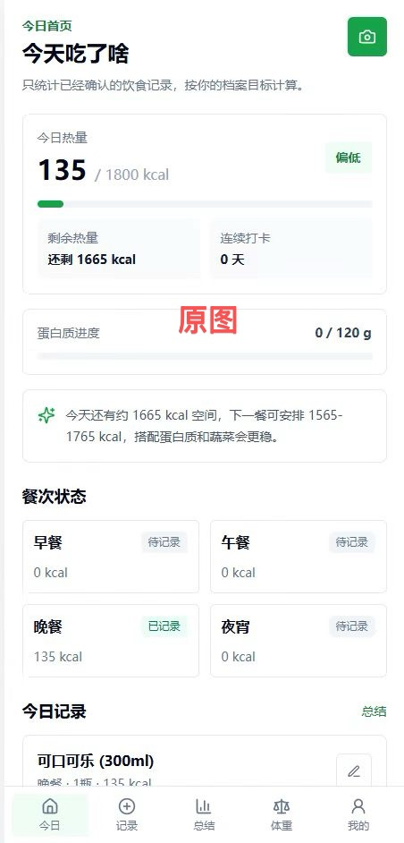
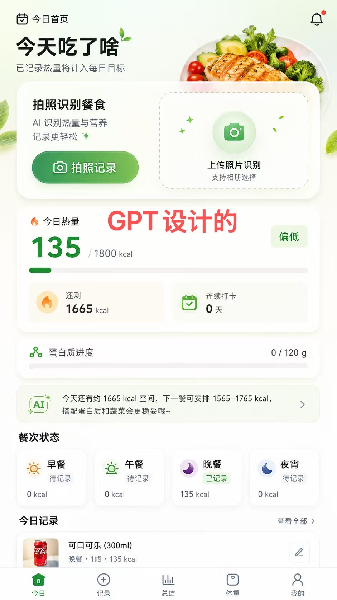
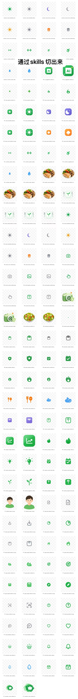

# UI Slice Extractor v3

## 给 Codex 安装

把仓库下载到本地后，在仓库目录执行：

```powershell
.\install.ps1
```

安装脚本会把 Skill 复制到当前用户的 Codex Skill 目录：

```text
%USERPROFILE%\.codex\skills\ui-slice-extractor
```

重启 Codex 后，可以直接说：

```text
使用 UI Slice Extractor，从这张 PNG/UI 截图中提取完整的前端静态资源包。
```

也可以显式调用：

```text
$ui-slice-extractor 从这张 UI 截图中提取 logo、icon、背景和透明装饰，并生成 manifest、预览图和 ZIP。
```

完整安装说明见 [INSTALL.md](INSTALL.md)。Skill 源文件位于 `skills/ui-slice-extractor/`，符合 Codex 的标准 Skill 仓库布局。

从一张没有 Figma/PSD 图层的扁平 PNG、JPG 或 UI 截图中，识别并重建前端可复用的静态资源包。

它不只是把截图裁成小块，而是先理解页面结构，再根据资产特点选择裁切、SVG 重绘、脚本重建、生图重建、透明化或背景重建。

## 它解决的真实业务问题

现在很多团队已经可以用 AI 快速生成一张很漂亮的产品设计稿，但真正要交付到前端时，往往会卡在几个地方：

- AI 给的是一张扁平图片，不是 Figma 图层、组件库或可运行代码
- 设计稿里的背景、装饰、图标和内容混在一起，前端无法直接复用
- 直接让代码模型“照着图片写页面”，容易出现布局像、素材不像，或者产生大量不可维护的硬编码
- 设计稿更新后，前端很难知道哪些是可复用资源，哪些只是页面上的一次性内容
- 透明 PNG、柔光装饰和被遮挡的背景，经常需要人工重新处理

所以，真正的痛点不是“AI 能不能画出一张图”，而是：

> AI 设计稿如何进入前端工程，并变成组件、静态资源、数据结构和可验证的交付物？

UI Slice Extractor 负责的就是中间这一层：把 AI 设计稿或扁平截图，转换成前端工程可以继续使用的资源包和结构化说明。

## 从 AI 设计稿到前端工程

推荐把它放在产品开发流程中的这个位置：

```text
产品需求 / 用户故事
        ↓
AI 生成设计稿或视觉方案
        ↓
UI Slice Extractor
  识别页面层级、资源和装饰
  重建 SVG、透明 PNG、背景和组件壳
  生成 manifest、预览图和校验报告
        ↓
前端工程接入
  资源进入 public/assets 或 src/assets
  页面拆成 Header、Card、List、BottomNav 等组件
  业务数据替换设计稿中的示例文案和数字
  状态、交互和接口由代码实现
        ↓
浏览器中得到可维护、可迭代的真实页面
```

这个 Skill 不试图把一张图片“魔法般地变成完整应用”。它把最容易阻塞前端的视觉资产整理出来，让开发者可以把精力放在组件结构、状态管理、接口和交互上。

## 前端接入示例

假设 AI 生成了一张“饮食记录首页”，前端可以按下面的方式落地：

| 设计稿内容 | 工程中的实现 |
|---|---|
| 页面背景和食物主视觉 | `public/assets/backgrounds/` 下的 WebP/PNG |
| 相机、日历、太阳、月亮图标 | `src/assets/icons/` 下的 SVG |
| 上传卡片中的叶子、星星、光晕 | `src/assets/overlays/` 下的真透明 PNG |
| 热量卡片、餐次卡片、底部导航 | React/Vue 组件和 CSS，而不是整张图片 |
| “135 kcal”“晚餐已记录”等内容 | 接口数据或本地状态 |
| 不同餐次、空状态、加载状态 | 组件 props、枚举和状态分支 |

例如，资源包接入后，页面代码可以保持成这样：

```tsx
<NutritionSummary
  consumed={135}
  target={1800}
  status="low"
  icon={icons.fire}
/>

<MealStatusGrid
  meals={[
    { type: 'breakfast', status: 'pending', calories: 0 },
    { type: 'lunch', status: 'pending', calories: 0 },
    { type: 'dinner', status: 'recorded', calories: 135 },
    { type: 'late-night', status: 'pending', calories: 0 },
  ]}
/>
```

这样做的关键是：图片只承担视觉资产的职责，业务数字、文案、状态和交互仍然由前端代码控制。设计稿可以换，接口数据可以变，组件不需要推倒重来。

## 适合哪些团队

- 产品或设计团队用 AI 快速探索视觉方向
- 前端团队需要把 AI 设计稿落成真实页面
- 独立开发者想快速做出接近设计稿的 MVP
- 设计系统尚未完善，但需要先沉淀可复用图标和装饰
- 需要把一次性的视觉探索转换成可评审、可测试、可维护的工程资产

## 效果展示

下面是一组实际测试流程。

<table>
  <tr>
    <td align="center" valign="top">
      <strong>1. 原始 UI</strong><br>
      <a href="docs/images/01-original-ui.jpg">
        
      </a>
    </td>
    <td align="center" valign="top">
      <strong>2. AI 优化后的设计稿</strong><br>
      <a href="docs/images/02-ai-redesign.jpg">
        
      </a>
    </td>
    <td align="center" valign="top">
      <strong>3. 使用 Skill 扫描并重建的资源</strong><br>
      <a href="docs/images/03-extracted-assets.jpg">
        
      </a>
    </td>
  </tr>
</table>

输出内容包括规则图标、状态图标、透明装饰层、食物图片、组件素材等。实际交付时还会生成资源清单、透明度校验报告、预览图和 ZIP 压缩包。

## 适用场景

- 只有一张 UI 截图，没有设计源文件或图层
- 希望提取 logo、icon、背景、装饰物和组件外壳
- 需要把截图中的素材整理成前端静态资源包
- 需要真透明 PNG，而不是带灰白棋盘格的假透明图片
- 原始背景被文字、按钮或卡片遮挡，需要重建背景层
- 柔光、渐变或插画素材不适合直接用 SVG 重画

## 工作方式

Skill 会先扫描完整设计图并推断隐藏的页面层级，然后给每个候选资产选择一种生产方式：

| 方式 | 适用内容 | 常见输出 |
|---|---|---|
| `crop_or_isolate` | 截图中完整、清晰且背景干净的素材 | PNG、WebP |
| `svg_redraw` | 规则图标、几何图形、箭头、虚线框 | SVG、PNG |
| `scripted_rebuild` | 需要精确方向或真透明的简单图形 | SVG、透明 PNG |
| `imagegen_then_transparentize` | 柔光、渐变、插画感装饰素材 | 透明 PNG |
| `background_reconstruction` | 被 UI 内容遮挡的页面或模块背景 | PNG、WebP |

## 目录结构

```text
ui-slice-extractor/
├─ SKILL.md                         Skill 主指令
├─ agents/openai.yaml               Codex 展示信息和默认提示词
├─ assets/manifest.schema.json      资源清单 JSON Schema
├─ examples/调用示例.md             完整调用示例
├─ prompts/生图模板.md              装饰、背景和图标生图模板
├─ references/混合重建工作流.md     详细工作流
├─ references/资产生产路径判断表.md 生产方式判断规则
├─ scripts/make_preview.py          生成资源预览总图
├─ scripts/package_assets.py        生成 manifest 并打包 ZIP
├─ scripts/transparentize_asset.py  图片透明化
└─ scripts/validate_assets.py       检查透明度、SVG 和假棋盘格
```

## 安装

### 方法一：安装到当前项目

把整个目录复制到项目的 Skill 目录：

```text
<your-project>/.agents/skills/ui-slice-extractor/
```

这种方式只对当前项目生效，适合随项目一起维护和分享。

### 方法二：安装到个人环境

复制到个人 Skill 目录：

```text
~/.agents/skills/ui-slice-extractor/
```

也可以按本地 Codex 环境的 Skill 目录配置安装。重新打开任务后，即可通过 `$ui-slice-extractor` 显式调用；配置允许时，相关请求也可以自动触发。

## 环境要求

- 支持 Skills 的 Codex/Agent 环境
- Python 3.9 或更高版本
- Pillow，用于预览、透明化和图片校验

安装 Pillow：

```bash
python -m pip install Pillow
```

如果任务需要生图重建，运行环境还需要具备可用的图片生成能力。Skill 本身不会保存 API Key，也不包含任何账号凭据。

## 快速使用

在对话中上传一张完整 UI 图片，然后输入：

```text
$ui-slice-extractor

我只提供这一张 PNG，没有 Figma 或 PSD 图层。
请扫描整张设计图，逆向识别并重建所有前端可复用静态资源。
能 SVG 重建的使用 SVG；柔光、渐变或插画素材可以生图重建后透明化。
背景图不要包含文字、按钮和业务卡片。
请输出 preview、manifest、validation-report 和 ZIP。
```

建议上传原始分辨率图片。压缩过度、截图不完整或带有大量标注框，会降低识别和重建质量。

## 推荐的需求描述

为了减少漏图，可以补充以下要求：

```text
1. 不要只处理我框出来的区域，请扫描全图。
2. 提取 logo、icon、背景图、组件壳、装饰元素和状态图标。
3. 小叶子、小星星、小光晕等装饰也要检查。
4. 透明素材必须是真透明 PNG。
5. 月亮、箭头和叶子等方向敏感元素需要核对方向。
6. 被文字或卡片遮挡的背景不要直接裁切，请生成干净的背景-only 版本。
```

## 默认输出

```text
ui-slice-output/
├─ icons/
├─ backgrounds/
├─ overlays/
├─ components/
├─ previews/
│  └─ preview_sheet.png
├─ manifest.json
├─ validation-report.json
├─ README.md
└─ asset_pack.zip
```

- `icons/`：图标、logo、状态小图
- `backgrounds/`：页面背景、模块背景、背景-only 图
- `overlays/`：叶子、星星、光晕等真透明装饰层
- `components/`：卡片壳、虚线框等组件素材
- `manifest.json`：文件类型、尺寸、透明状态、重建方式和推荐用途
- `validation-report.json`：透明通道、SVG 有效性和假棋盘格检查结果
- `preview_sheet.png`：全部图片资产的总览图
- `asset_pack.zip`：可直接交付给前端的资源压缩包

## 辅助脚本

以下命令在 Skill 目录中执行。

### 校验资源

```bash
python scripts/validate_assets.py <output_dir>
```

重点检查：

- PNG 是否具有 alpha 通道
- 透明区域的最小 alpha 是否为 0
- 是否疑似把灰白棋盘格画进图片
- SVG 文件是否包含有效的 `<svg>` 内容

### 生成预览图

```bash
python scripts/make_preview.py <output_dir>
```

生成：

```text
<output_dir>/previews/preview_sheet.png
```

预览图中的棋盘格只用于展示透明区域，不会写回原始资产。

### 透明化图片

```bash
python scripts/transparentize_asset.py input.png output.png --mode corner --crop
```

可用模式：

- `white`：处理白色或近白色背景
- `corner`：根据图片四角推断背景色
- `checkerboard`：移除疑似灰白棋盘格背景
- `--crop`：按透明边界紧凑裁剪，并保留少量留白

透明化属于启发式处理。带白色主体、复杂阴影或与背景颜色接近的素材，需要人工检查边缘。

### 生成清单并打包

```bash
python scripts/package_assets.py <output_dir> <project_name>
```

该命令会生成 `manifest.json`，并在输出目录的上一级创建：

```text
<project_name>_asset_pack.zip
```

## 质量检查清单

在把资源交付给前端前，建议确认：

- 预览图中没有遗漏主要素材和小装饰
- 透明 PNG 在深色、浅色背景下都没有明显白边
- 图片中没有灰白棋盘格、水印、红色标注框或业务文字
- 月亮、箭头、叶子等方向和原设计一致
- 背景-only 图片保留了足够的 UI 叠加空间
- `manifest.json` 中的文件名、目录、尺寸和重建方式正确
- `validation-report.json` 没有未处理的错误
- ZIP 可以正常解压，且不包含原始敏感截图、缓存或临时文件

## 常见问题

### 为什么不把所有内容都重画成 SVG？

SVG 适合规则、清晰的几何图标。柔光、阴影、渐变和轻插画素材强行矢量化后通常会显得生硬，因此更适合生图或脚本重建。

### 为什么背景图不能直接从截图裁下来？

截图中的背景经常被文字、按钮和卡片覆盖。直接裁切会把业务 UI 一起带入资源，因此需要推断并重建干净的背景层。

### 有 alpha 通道就是透明 PNG 吗？

不一定。图片可能有 alpha 通道，但所有像素仍然完全不透明。校验报告会检查是否真正存在 alpha 为 0 的像素。

### 为什么自动透明化后会出现白边？

背景移除是根据颜色距离估算的。主体边缘、柔光和阴影可能与背景混合，需要调节模式、阈值，或者重新生成更干净的素材。

### 可以直接用于商业项目吗？

工具代码是否允许商用取决于仓库采用的许可证；重建素材还需要确认原始设计、图片、字体和品牌标识的版权。公开发布前请为仓库选择许可证，并确保演示图拥有公开展示权限。

## 发布到 GitHub

本目录不包含 API Key、Token、密码或个人联系方式，可以作为独立仓库发布。发布前仍建议：

1. 确认三张演示图允许公开展示。
2. 选择合适的开源许可证，例如 MIT；未添加许可证时，默认不代表他人可以自由复制或修改。
3. 不要提交真实项目的原始客户截图、生成缓存、临时目录或含个人数据的输出包。
4. 在首次发布前检查 Git 历史，避免敏感信息曾经被提交后又仅从当前文件中删除。

一个基础发布流程如下：

```bash
git init
git add .
git commit -m "Initial release of UI Slice Extractor v3"
git branch -M main
git remote add origin https://github.com/<your-account>/ui-slice-extractor.git
git push -u origin main
```

## 安全与隐私

- 本 Skill 不需要在仓库中保存 API Key 或登录凭据。
- 不要把包含姓名、手机号、住址、账号、客户数据或内部系统信息的原始 UI 截图上传到公开仓库。
- 如需公开实际案例，应优先使用匿名数据、虚构数据或获得授权的演示素材。
- 演示截图中的本地文件路径、用户名和临时文件 UUID 不应出现在文档中；本仓库中的示例图片已使用通用文件名。
